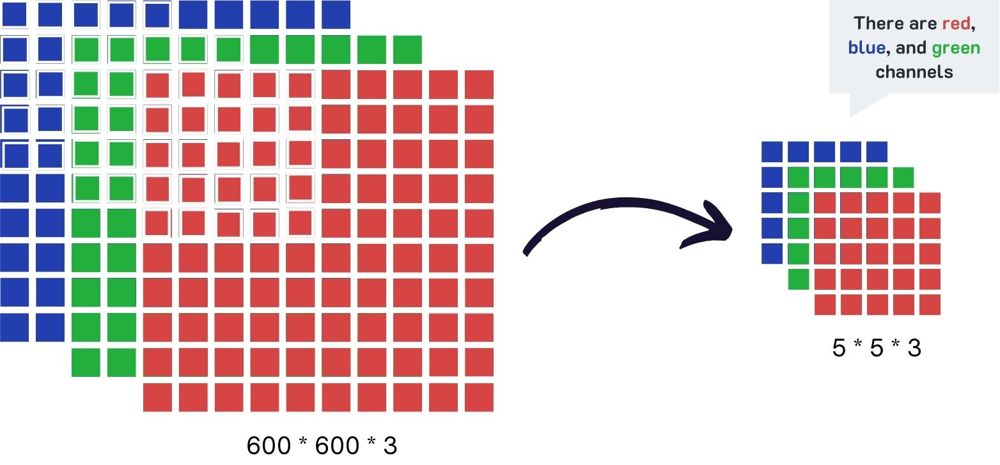
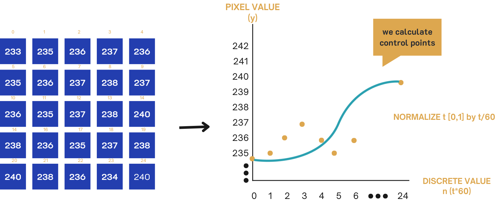
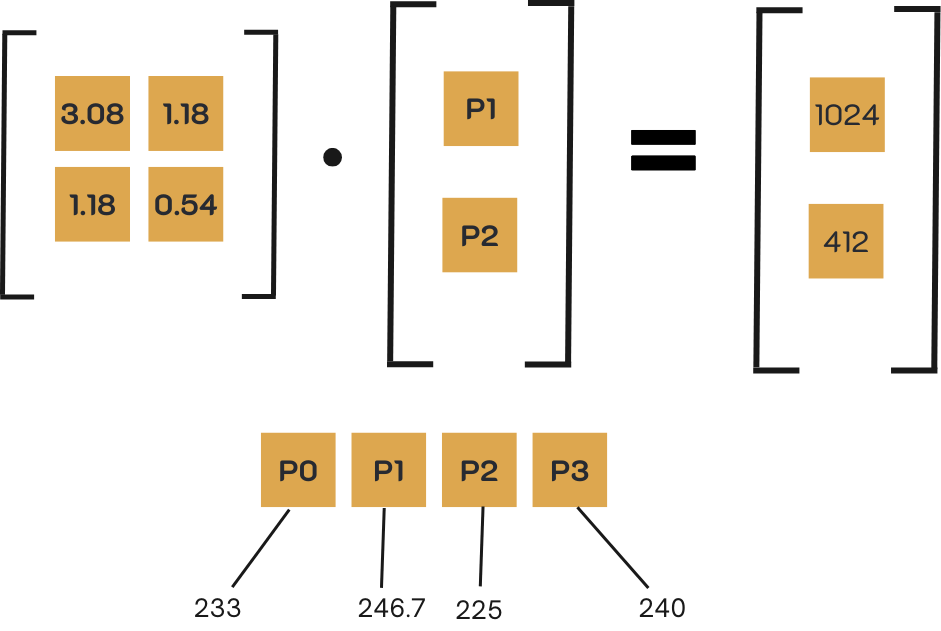
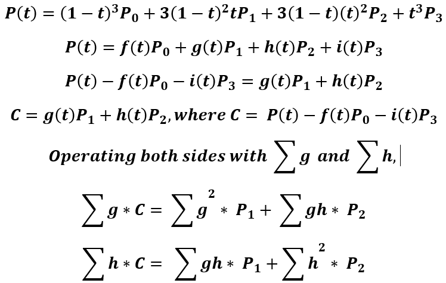
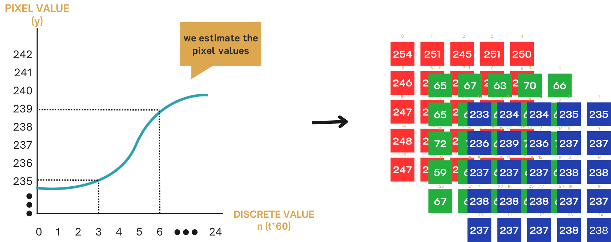

# Image Compression Using Bézier Curve
## What is this project about?
This project demonstrates an image compression method for 600x600 RGB images by applying cubic Bézier curves. The technique significantly reduces storage space while maintaining visual quality, achieving a compression ratio of approximately 6:1.

## Overview
The compression works by dividing the image into blocks of 25 pixels and fitting a cubic Bézier curve to each block. For each block, only 4 control points (P₀, P₁, P₂, and P₃) are stored. These control points are used to reconstruct the pixel values by calculating the curve's t values, providing an efficient way to encode and decode the image.

## Methodology
- **Image Blocking:** The image is divided into 24x24 blocks, each containing 25 pixels.
  
  

  
  

- **Curve Fitting:** For each block, a cubic Bézier curve is calculated by fitting 4 control points.
 

  
  

- **Compression:** Only the 4 control points (P₀, P₁, P₂, and P₃) are stored instead of the pixel values.

- **Formulation of general equations from Cubic Bezier Curve**
 

 
 

  
   

  
  

  
- **Decompression:** The pixel values are reconstructed using the stored control points and calculated t values.

 

  
  

  ## Screenshots

  

